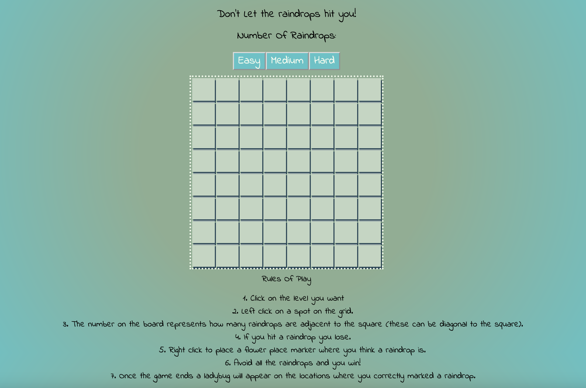

# Minesweeper

[Minesweeper Link](https://minesweeper-amandafox.netlify.app/)

- I created a desktop site that communicated with a back-end API server to create the user-interface for a Minesweeper clone.

- Skills used

  - Understand how state drives changes to an interface in React

  - Respond to user events in React

  - Understand and use REST APIs

  - Use React lifecycle methods

  - Understand and interpret API documentation
